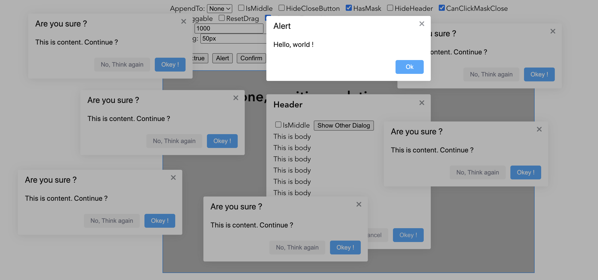

## Dialog

[](https://nodei.co/npm/vue-m-dialog/)

A Modal component for Vue 3.x.

> Please use the [2.x](tree/v2.x) in Vue 2.x.

[Live Demo](https://mengdu.github.io/m-dialog/index.html)



## Usage

```ls
npm install vue-m-dialog
```

```js
import MDialogPlugin from 'vue-m-dialog'
import 'vue-m-dialog/dist/style.css'

// will set global
// component `<m-dialog></m-dialog`
// method `this.$alert(...)`
// method `this.$confirm(...)`
Vue.use(MDialogPlugin)

// or reset
Vue.use(MDialogPlugin, {
  // <m-dialog></m-dialog>
  dialogName: 'm-dialog',
  // this.msg(...)
  alertName: 'msg',
  // this.confirm(...)
  confirmName: 'confirm',
  // Set default options for messageBox
  messageBoxDefaultOptions: {
    // ...
  },
})
```

```html
<m-dialog
  v-model="show"
  title="Dialog Title"
  >
  <p>This is body...</p>
  <p>This is body...</p>
  <p>This is body...</p>
  <template v-slot:footer>
    <button class="m-dialog--cancel-btn" @click="show = false">Cancel</button>
    <button class="m-dialog--confirm-btn" @click="show = false">Okey !</button>
  </template>
</m-dialog>
```

### Dialog Attributes

| Attribute | Type | Description | Default |
|-----------|------|-------------|---------|
| modelValue/v-model | boolean | Visibility of dialog | — |
| title | string | Title | — |
| appendTo | string | Append dialog itself to other container; use `body`, `#<ID>`, `null` | 'body' |
| class | string | Custom class names for dialog | — |
| width | string | Width of dialog | '400px' |
| padding | string | Padding of dialog | '25px' |
| top | string | Margin top of dialog | '50px' |
| zIndex | string/number | zIndex for dialog wrapper | 1000 |
| isMiddle | boolean | Show on middle | false |
| hideHeader | boolean | Hide header | false |
| hasMask | boolean | It has mask | true |
| hideCloseButton | boolean | It has close button | false |
| canClickMaskClose | boolean | Whether can be closed by clicking the mask | false |
| draggable | boolean | Enable dragging feature for dialog  | false |
| resetDrag | boolean | Whether to reset positon when displaying again | false |
| isPointerEventsNone | boolean | Can click outside dialog when `hasMask=false` | false |
| beforeClose | (cb: (ok: boolean) => void) => void | Callback before closes, and it will prevent Dialog from closing | — |

### Dialog Slots

| Name   | Description             |
|--------|-------------------------|
| -      | Content of the dialog |
| title  | Content of the dialog title |
| footer | Content of the dialog footer |

Use the defined footer style:

```html
<template v-slot:footer>
  <button class="m-dialog--cancel-btn" @click="show = false">Cancel</button>
  <button class="m-dialog--confirm-btn" @click="show = false">Okey !</button>
</template>
```

### Dialog Events

| Name | Description  | Params |
|------|--------------|---------|
| close    | Triggers when the Dialog closes | — |
| open     | Triggers when the dialog opens | — |

## MessageBox

A messageBox mainly for alerting information, confirm operations.

> MessageBox plugin base on Dialog component.

```js
import { alert, confirm, createMessageBox, closeAll } from 'vue-m-dialog'
```

Interface of messageBox

```ts
import { AppContext } from 'vue';
export interface MessageBoxOptions {
    title?: string;
    message?: string | JSX.Element | (() => JSX.Element);
    class?: string;
    width?: string;
    padding?: string;
    top?: string;
    zIndex?: string | number;
    isMiddle?: boolean;
    hideHeader?: boolean;
    hasMask?: boolean;
    draggable?: boolean;
    isPointerEventsNone?: boolean;
    showCancelButton?: boolean;
    showConfirmButton?: boolean;
    disableCancelButton?: boolean;
    disableConfirmButton?: boolean;
    cancelButtonText?: string;
    confirmButtonText?: string;
    beforeClose?: (cb: (ok: boolean) => void) => void;
    onOpen?: () => void;
    onRemove?: () => void;
    [key: string]: any;
}
export declare function createMessageBox(options: MessageBoxOptions, context?: AppContext): Promise<{
    action: string;
    ok: boolean;
}>;
export declare const alert: (message: string, title?: string | undefined, options?: MessageBoxOptions | undefined, context?: AppContext | undefined) => Promise<{
    action: string;
    ok: boolean;
}>;
export declare const confirm: (message: string, title?: string | undefined, options?: MessageBoxOptions | undefined, context?: AppContext | undefined) => Promise<{
    action: string;
    ok: boolean;
}>;
export declare const closeAll: () => void;
export declare const setDefaultOptions: (opts?: MessageBoxOptions | undefined) => void;
```

### LICENSE

MIT [LICENSE](LICENSE)
